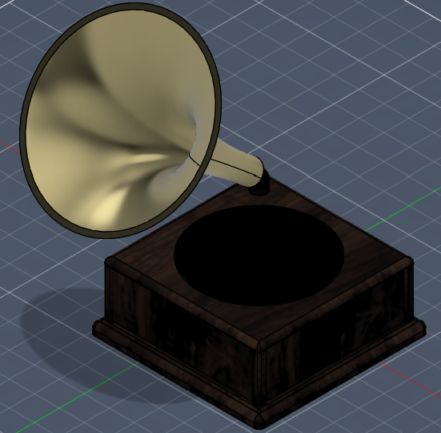
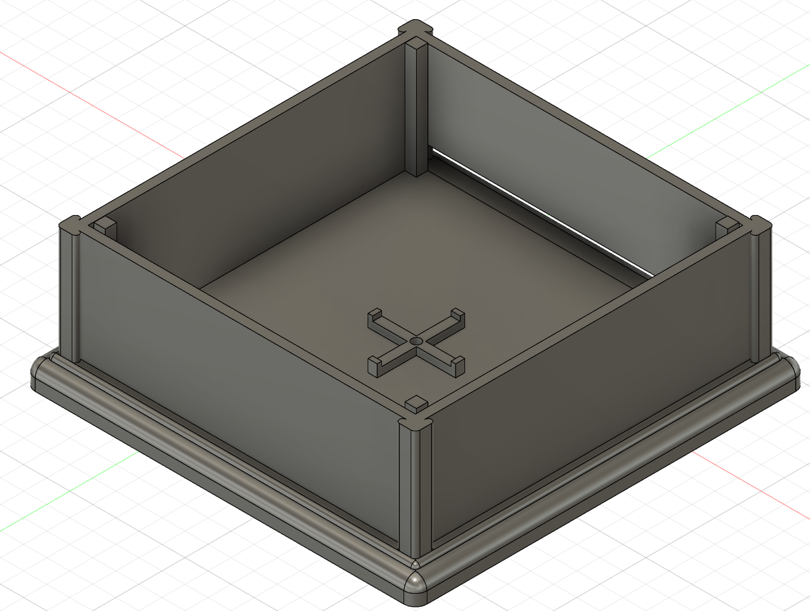
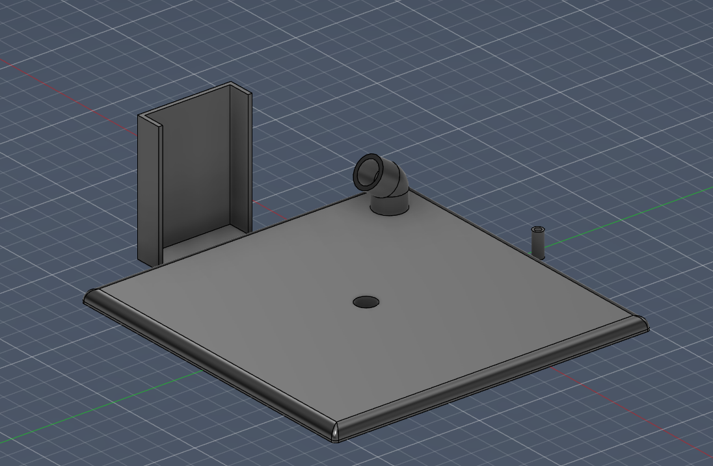
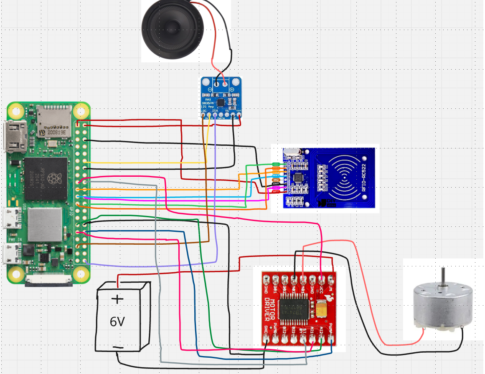

# GramophoNFC

---
GramophoNFC is a gramophone which uses nfc technology to play songs

---

## What is this:
This is a 3D printable gramophone with a NFC reader inside. All disks have a nfc sticker containing information about the song such as the name. When the disk is put onto the gramophone the reader reads all necessary information, starts the song and rotates the disk. The speaker is inside the horn, the rest of the technolgoy is inside the main part. It uses a Raspberry Pi Zero 2W to control the other parts. A 5V motor (which can run with lower voltage) to spin the disk and a 3" speaker for good sound. There are also other parts such as the RFID board or amplifiers (see more in the bom)

## Images:
The GramophoNFC:

Some other pictures showcasing the structure:

Wiring:

## Getting started:
1. Get all necessary parts
2. 3D print the gramophone
3. Flash the pi with the source code and **important** add the songs to the code with the correct path
4. Add the nfc stickers on the disk and write on them the necessary info with e.g. a free mobile app
5. Build everything together (glue the rfid holder under the top) and make sure it works and be careful!
6. Enjoy it

## BOM:
| Name | Description | Unit Price ($) | Amount | Total Price (incl. tax) | Link |
| --- | --- | --- | --- | --- | --- |
| Raspberry Pi Zero 2W | brain of the gramophon | 26.69 | 1 | 26.69 | https://www.amazon.de/Raspberry-Pi-Zero-2-W/dp/B09KLVX4RT |
| RC522 RFID board | read the nfc chip | 5.93 | 1 | 5.93 | https://eckstein-shop.de/Keyestudio-MFRC522-RFID-Module-Kit-with-IC-Card-Key-Ring-Compatible-with-Arduino |
| NFC stickers in the disk | saving name | 0.16 | 12 | 1.92 | https://www.amazon.de/Original-Transparent-Programmierbar-Wiederbeschreibbar-NFC-f%C3%A4higen/dp/B0F24L4GDM |
| MAX98357A | amplifier for the speaker | 3.11 | 1 | 3.11 | https://www.amazon.de/MAX98357A-Verst%C3%A4rker-Einstellbarem-H%C3%B6rsystemlautsprecher-Treibermodul/dp/B0FK572X32 |
| 3" Speaker (4Ω 3W) | the speaker | 5.88 | 1 | 5.88 | https://eckstein-shop.de/AdafruitSpeaker-322Diameter-4Ohm3WattforAudioProject |
| TB6612FNG | motor driver | 5.92 | 1 | 5.92 | https://www.amazon.de/DollaTek-TB6612FNG-Motorantriebsmodul-Arduino-Microcontroller/dp/B07DJ5734C |
| 5V DC Motor R300C 8800RPM | to spin the disk | 2.54 | 1 | 2.54 | https://eckstein-shop.de/R1505VDCMotor6000RPMLeerlauf2F4000RPMLast2F3-5VDC |
| 4.5V battery | powering the motor | 2.24 | 1 | 2.24 | https://www.amazon.de/Velamp-3R12-1BP-Pila-Blech/dp/B00966D8EY |
| Wires | wiring | 8.09 | 1 | 8.09 | https://www.amazon.de/ELEGOO-Jumper-Steckbr%C3%BCcken-Drahtbr%C3%BCcken-Arduino/dp/B01EV70C78 |

Total: 62,32 $ (without shipping)
Please note that the prices may change and there can be better buy options depending on your location

## Why I made this:
I've always wanted a gramophone but they pricey :(

So I tried my best